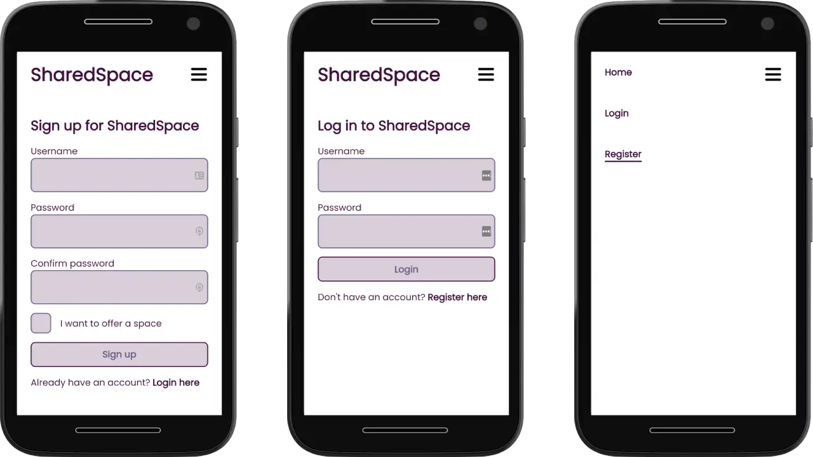
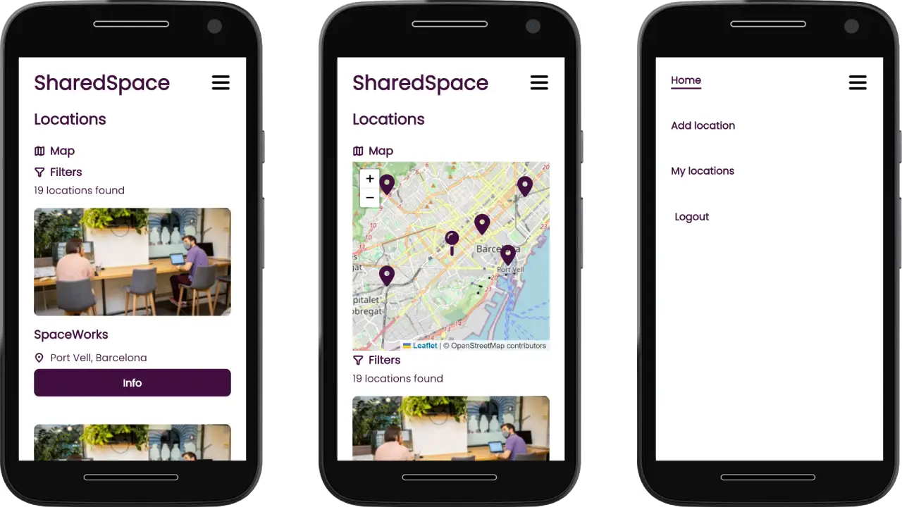

[](https://sonarcloud.io/summary/new_code?id=isdi-coders-2022_Benjamin-Rae_Front-Final-Project-202209-BCN)
[](https://sonarcloud.io/summary/new_code?id=isdi-coders-2022_Benjamin-Rae_Front-Final-Project-202209-BCN)
[](https://sonarcloud.io/summary/new_code?id=isdi-coders-2022_Benjamin-Rae_Front-Final-Project-202209-BCN)
[](https://app.netlify.com/sites/benjamin-rae-front-final-project-2022/deploys)

## **SharedSpace**

SharedSpace is a website that allows coworking owners to add and manage their coworking locations. It is built using Angular, Ngrx, SCSS, Jest, and Angular Testing Library.

[Visit SharedSpace](https://benjamin-rae-front-final-project-2022.netlify.app/)




### **Features**

- Add and manage coworking locations
- Use Leaflet to display the location of the coworking space on a map
- Filter by services offered by the coworking locations
- Secure authentication using JSON web tokens

### **Tech Stack**

- Angular: a popular frontend framework for building web applications
- Ngrx: a Redux-inspired state management library for Angular apps
- SCSS: a CSS preprocessor that adds advanced features such as variables and nested rules
- Jest: a popular JavaScript testing framework
- Angular Testing Library: a library that makes it easier to test Angular components
- Leaflet: an open-source JavaScript library for displaying maps on web pages
- JSON web tokens: a JSON-based open standard for creating access tokens that can be securely transmitted between parties.

### Future Implementations

- Allow owners to manage the spaces inside their locations
- Allow users to book spaces at their chosen locations

### **Getting Started**

To get started using SharedSpace, you'll need to have the following tools installed:

- **[Node.js](https://nodejs.org/en/)**
- **[Angular CLI](https://cli.angular.io/)**

Once you have these tools installed, you can clone the SharedSpace repository and install the dependencies by running the following commands:

```
Copy code
git clone https://github.com/isdi-coders-2022/Benjamin-Rae_Front-Final-Project-202209-BCN.git
cd Benjamin-Rae_Front-Final-Project-202209-BCN
npm install

```

After the dependencies have been installed, you can start the development server by running **`ng serve`** and visiting **`http://localhost:4200/`** in your web browser.

### **Running Tests**

SharedSpace uses Jest and Angular Testing Library for unit and integration tests. To run the test suite, use the **`npm test`** command.

### **Deployment**

To deploy SharedSpace to a production environment, run the **`ng build --prod`** command to build a production-ready version of the app. This will generate a **`dist`** directory containing the compiled code, which you can then serve using a static file server.
